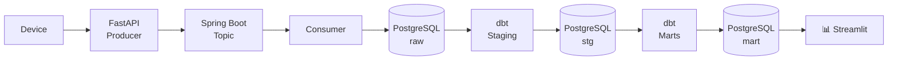

# Service Metrics Service

A Spring Boot microservice that decouples Kafka producer/consumer functionality from the `service-metrics-pipeline` project.
Exposes a REST API for publishing service metrics data to Kafka and persisting them to PostgreSQL.

---

## Tech Stack

- **Java 17**
- **Spring Boot 4.0.6**
- **Spring Web MVC** — REST API
- **Spring Kafka** — Producer/Consumer
- **Spring Data JPA** — PostgreSQL persistence
- **Spring Security** — API key authentication
- **Docker Compose** — Kafka + Kafka UI + PostgreSQL
- **Lombok** — Boilerplate reduction

---

## Data Flow

### Streaming (Speed Test)


## Getting Started

### Prerequisites

- Java 17+
- Maven
- Docker + Docker Compose

### Setup

1. **Clone the repository**
   ```bash
   git clone https://github.com/kirkalyn13/service-metrics-service.git
   cd service-metrics-service
   ```

2. **Create your env file** — copy the example and fill in values:
   ```bash
   cp .env.example .env # You may need to further configure this on your IDE
   ```

3. **Start infrastructure** — Spring Boot Docker Compose support handles this automatically on app startup, or run manually:
   ```bash
   docker compose up -d
   ```

4. **Run the application**
   ```bash
   mvn spring-boot:run
   ```
   Or via IntelliJ using the run button with the `.env` file configured under **Run Configurations > EnvFile**.

---

## Configuration

### Environment Variables (`dev.env`)

```env
# PostgreSQL
PG_URL=jdbc:postgresql://localhost:5435/db_name
PG_USER=username
PG_PASSWORD=password

# API Security
API_KEY=your-secret-api-key
```

### `application.yaml`

```yaml
server:
  port: 8081

spring:
  application:
    name: service-metrics-service
  datasource:
    url: ${PG_URL}
    username: ${PG_USER}
    password: ${PG_PASSWORD}
  jpa:
    database-platform: org.hibernate.dialect.PostgreSQLDialect
  kafka:
    bootstrap-servers: localhost:9092

api:
  key: ${API_KEY}
```

---

## API Reference

### Base URL
```
http://localhost:8081/api/v1
```

### Authentication

All endpoints require an API key passed as a request header:
```
X-API-Key: your-secret-api-key
```

---

### POST `/speed-test`

Publishes a speed test result to Kafka and persists it to PostgreSQL.

**Request Body**
```json
{
  "timestamp": "2026-05-25T09:24:36.148779Z",
  "isp": "Spectrum",
  "ip": "35.144.158.14",
  "location": "Kingsport, TN",
  "download_speed_mbps": 1037.11,
  "upload_speed_mbps": 39.28,
  "idle_latency_ms": 28.0,
  "download_latency_ms": 34.0,
  "upload_latency_ms": 27.0
}
```

**Response — 200 OK**
```json
{
  "status": "published",
  "topic": "speed_test"
}
```

**Response — 401 Unauthorized**
```json
{
  "status": "failed",
  "topic": "Invalid or missing API key"
}
```

**Response — 500 Internal Server Error**
```json
{
  "status": "failed",
  "topic": "speed_test"
}
```

---

## Infrastructure

### Docker Services (`compose.yml`)

| Service     | Port  | Description              |
|-------------|-------|--------------------------|
| Kafka       | 9092  | Kafka broker             |
| Kafka UI    | 8081  | Kafka management console |
| PostgreSQL  | 5435  | Metrics database         |

### Kafka

- **Topic:** `speed_test`
- **Partitions:** 1
- **Replicas:** 1
- **Consumer Group:** `service_metrics_pipeline`

---

## Related Projects

- [`service-metrics-pipeline`](https://github.com/kirkalyn13/service-metrics-pipeline) — The parent pipeline project this service was decoupled from, handling XLSX ingestion, dbt transformations, Airflow orchestration, and a Streamlit dashboard.

---

## Authors

- [Engr. Kirk Alyn Santos](https://github.com/kirkalyn13)

## License

MIT